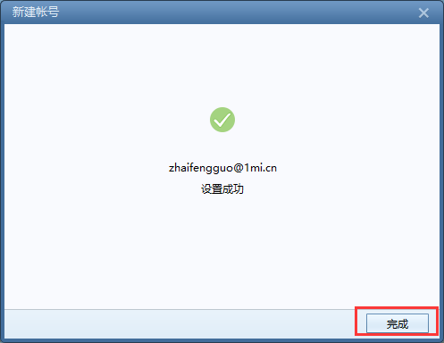

# 对foxmail进行配置

### 2.1 打开`foxmail`, 找到桌面的快捷方式,双击打开:

### 2.2 打开foxmail后,会提示你填写你的邮箱帐号,在`E-mail地址`栏里填写你邮件帐号,比如`zhaifengguo@1mi.cn`, 在`密码`栏里填写你的密码,然后,点击`创建`

### 2.3 提示`设置成功`, 点击`完成`.

### 2.4 设置完成后,会进入管理界面, foxmail会自动收取邮件. 

### 2.5 手动收取邮件: 选中你相应的邮箱,鼠标右击,选择`收取`即可.

