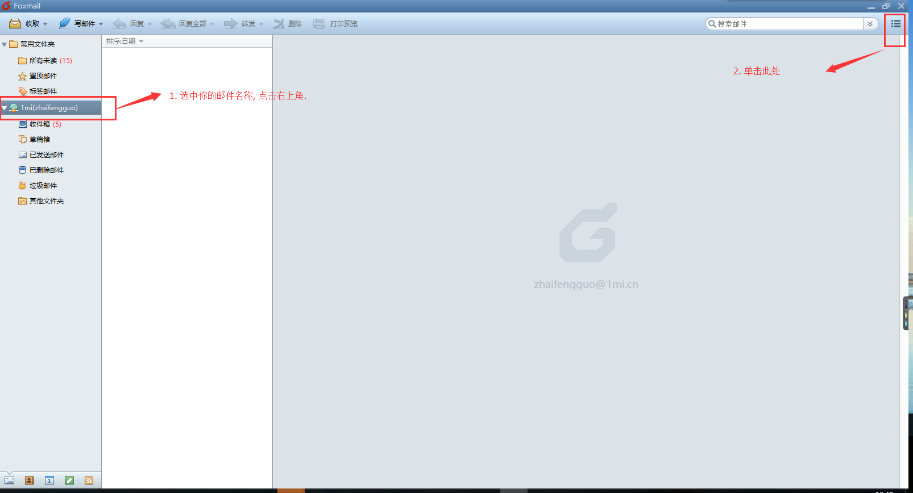
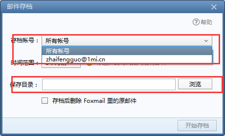
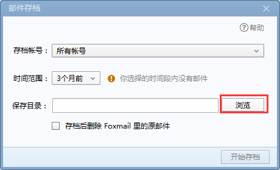

# 设置邮件存档

我们收取了我们的邮件到本地计算机了,然后我们来做怎么把邮件进行存档.

### 3.1 在foxmail左侧,选中你的帐号,在右上角点击`菜单`,出现一下画面:

### 3.2 选择`工具`,单击`邮件存档`:

### 3.3 在邮件存档界面中, 选择你要存档的帐号(或者所有帐号), 在`时间范围`内,选择`自定义`,选择要备份的时间段,在`保存目录`中,选择浏览,然后,在`D`盘,新建一个文件夹`邮件存档`,
> 根据自身的情况选择时间段,每个人入职时间不一样,邮件的的时间也会不一样.

### 3.4 点击`开始存档`,会保存你的邮件

