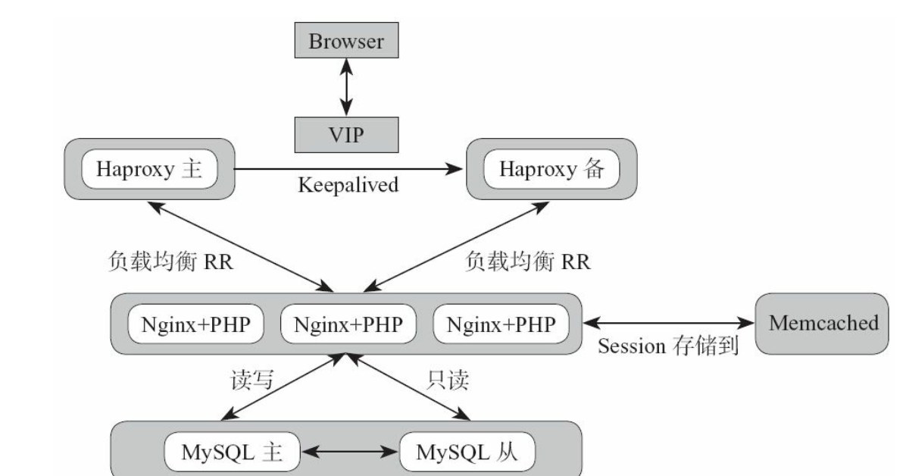

# 案例说明--中小型Web架构
----

## 主要功能
1. 系统初始化
2. Haproxy服务
3. Keepalived
4. Ngnix服务
5. PHP (FastCGI)服务
6. Memcached服务

## 架构图


## 
- 系统初始化
- 功能模块: Nginx, PHP, Haproxy, Keepalived的安装与管理,每一个功能创建一个目录来存放
- 业务模块, 在功能模块中我们编写了大量基础的功能状态,在业务层面直接进行引用, 所以功能模块就是尽可能的全,而且独立. 而业务模块不同的业务类型就可以在Include功能里面的安装和部署, 每个业务使用自己独特的配置文件等. 最终在top.sls里面只需要个某个Minion指定一个业务状态即可.


## 环境规划

### 1. 设置SaltStack中的file_roots 和 pillar_roots

```
file_roots:
   base:
     - /srv/salt/base
   prod:
     - /srv/salt/prod
pillar_roots:
  base:
    - /srv/pillar/base
  prod:
    - /srv/pillar/prod

```

### 2. 试验环境规划

|主机名|  IP地址| 角色|
|----|----|----|
|saltstack-node1| 192.168.56.21| Master, Minion, Haproxy+Keepalived, Nginx+PHP|
|saltstack-node2| 192.168.56.22| Minion,Memcached,Haproxy+Keepalived,Nginx+PHP|


## 执行
```bash
salt '*' state.hightstate test
salt '*' state.hightstate

```
